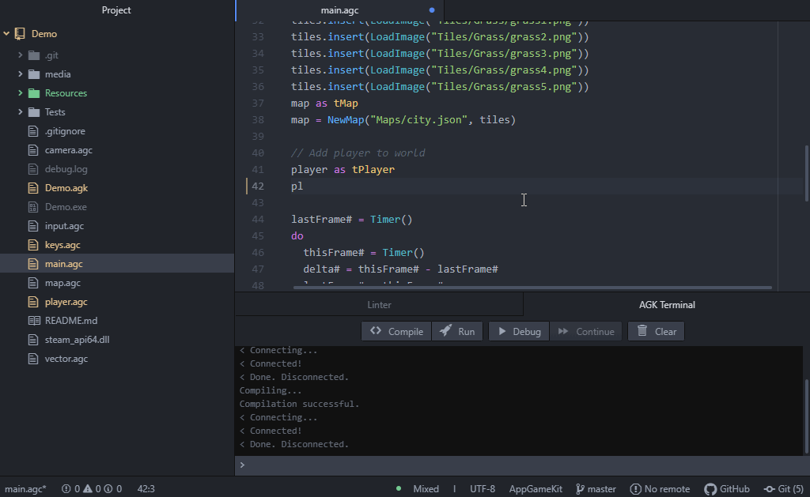

# AppGameKit for Atom
Use Atom to develop games with [AppGameKit](https://www.appgamekit.com/)!
This plugin adds support for the AppGameKit Tier 1 (BASIC) language and all the
utilities you'd expect from a modern editor, such as syntax highlighting,
intellisense, on-demand compilation, and a REPL-oriented debugger.

# Features at a glance
* Syntax highlighting
* Autocomplete for functions, types, constants, globals and variables
* Compile and run
* Debugger using breakpoints and REPL
* Open help when pressing F1 in a built-in function
* New project generator

# Generating a new project
Simply `ctrl-shift-p` (`cmd-shift-p` on macOS) and run `generate-project` from
there. That will create a new folder at your specified location with a basic AGK
project skeleton so you can start hacking right away!

# Default key bindings
These bindings only apply when editing AGK (`.agc`) files, and can be changed in
the package configuration. By default:

* F1: Open documentation for built-in function under cursor, or documenation home if the function was not found (`atom-agk:open-definition`)
* F4: Toggle debugger breakpoint in current line (`atom-agk:toggle-breakpoint`)
* F5: Compile project and run (`atom-agk:compile-and-run`)
* F6: Compile project and run in debug mode (`atom-agk:debug`)
* F7: Compile project (`atom-agk:compile`)
* F8: Toggle the debugger terminal (`atom-agk:toggle-terminal`)

# Notes
This is beta-quality software. Pull requests, bug reports and suggestions are
welcome. Some things to note:

* Only been tested in Windows, it will most likely break on other platforms
* Only works with AGK Classic, as Studio doesn't expose the compiler executable

# Thanks
Particular thanks to the guys at TheGameCreators forums and in particular
[MadBit](https://forum.thegamecreators.com/user/16e3dff53459a69a78e8c26031783c78)
for all the help running the debugger and using the compiler from the CLI.
