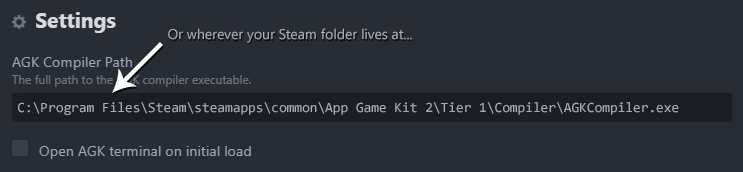

# AppGameKit for Atom
Use Atom to develop games with [AppGameKit](https://www.appgamekit.com/)!
This plugin adds support for the AppGameKit Tier 1 (BASIC) language and all the
utilities you'd expect from a modern editor, such as syntax highlighting,
intellisense, on-demand compilation, and a REPL-oriented debugger.

# Features at a glance
* Syntax highlighting
* Autocomplete for functions, types, constants, globals and variables
* Go To Definition for user-defined functions
* Compile and run
* Debugger using breakpoints and REPL
* Most common snippets
* Open help when pressing F1 in a built-in function
* New project generator

# Installation
Install it like any other package, just `ctrl-,`, go to packages, search for
`atom-agk`, and that's it!

You may need to customize the path to your `AGKCompiler.exe` file:

# Default key bindings
These bindings only apply when editing AGK (`.agc`) files, and can be changed in
the package configuration. By default:

* F1: Open documentation for built-in function under cursor, or documenation home if the function was not found (`atom-agk:open-help`)
* F2: Go to function definition for function under cursor (`atom-agk:go-to-definition`)
* F3: Go to include for `#include` or `#insert` in current line (`atom-agk:go-to-include`)
* F4: Toggle debugger breakpoint in current line (`atom-agk:toggle-breakpoint`)
* F5: Compile project and run (`atom-agk:compile-and-run`)
* F6: Compile project and run in debug mode (`atom-agk:debug`)
* F7: Compile project (`atom-agk:compile`)
* F8: Toggle the debugger terminal (`atom-agk:toggle-terminal`)
* F9: Toggle symbol explorer (`atom-agk:toggle-symbol-explorer`)

# Generating a new project
Simply `ctrl-shift-p` (`cmd-shift-p` on macOS) and run `generate-project` from
there. That will create a new folder at your specified location with a basic AGK
project skeleton so you can start hacking right away!

# Snippets
This package comes bundled with the most common snippets. To use a snippet, just
type the snippet and then press `tab`. That's it! Continue pressing `tab` to
navigate to the different positions within the snippet.

Some built-in snippets are `func`, `type`, `if`, `for`, `while`, `repeat`,
`select`, `case`, and `dim`.

You can always implement your own! Find out how
[here](https://flight-manual.atom.io/using-atom/sections/snippets/).

# Go To Definition
You can press `F2` (or bind `atom-agk:go-to-definition` to any key combination
you want) while stepping on a function to go to it's definition!

# Symbol Explorer
You can press `F9` (`atom-agk:toggle-symbol-explorer`) to toggle the symbol
explorer:

Symbols from the current file will be showed on top. All other symbols will be
sorted alphabetically.

# Notes
This is beta-quality software. Pull requests, bug reports and suggestions are
welcome. Some things to note:

* Only been tested in Windows, it will most likely break on other platforms
* Only works with AGK Classic, as Studio doesn't expose the compiler executable

# Thanks
Particular thanks to the guys at TheGameCreators forums and in particular
[MadBit](https://forum.thegamecreators.com/user/16e3dff53459a69a78e8c26031783c78)
for all the help running the debugger and using the compiler from the CLI.
